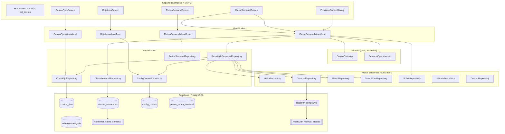
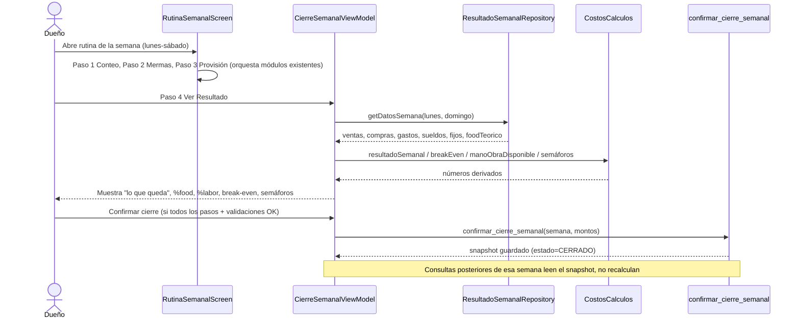
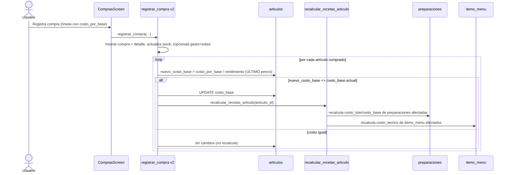

# Documento de Diseño — Control de Costos

## Overview

Esta funcionalidad conecta módulos que hoy viven aislados (compras, gastos, sobres, mano de obra, ventas, recetas) y los lleva a una **cadencia semanal (lunes a sábado)** para responder una pregunta simple: **cuánto le queda al dueño al final de la semana**.

El problema central que resuelve: hoy una compra actualiza stock y costo pero **no aparece como egreso** en ningún resultado, por lo que la caja real queda inflada. El diseño cierra ese hueco con:

1. **Costos fijos recurrentes** (`costos_fijos`) prorrateados a la semana.
2. **Cierre semanal con snapshot congelado** (`cierres_semanales`): una foto de la semana que no se recalcula al cambiar precios después.
3. **Costo del artículo por último precio** (reemplaza el promedio ponderado en la RPC `registrar_compra`) con recálculo automático de recetas y food cost.
4. **Categorización de artículos** (`articulos.categoria`) para agrupar costos variables.
5. **Cálculos de gestión**: break-even semanal, mano de obra disponible, semáforos configurables.
6. **Provisión en sobres**: sugerencia de transferencia CUENTA→FONDO por el prorrateo semanal de cada fijo, reutilizando `SobreRepository.transferir`.
7. **Rutina semanal guiada**: checklist que orquesta conteo, mermas, provisión y resultado.
8. Una **sección "Costos"** propia en el menú y terminología unificada ("costos" en vez de "gastos").

Fuera de alcance (Requerimiento 17): utilidad neta y reparto entre socios.

### Decisiones de diseño clave

| # | Decisión | Justificación |
|---|----------|---------------|
| D1 | Capa de **cálculo puro** (`domain/costos/CostosCalculos.kt`) sin dependencias de red | Permite property-based testing de prorrateo, break-even, mano de obra y márgenes sin Supabase |
| D2 | El costo del artículo pasa a **último precio** (reemplaza promedio ponderado) y solo recalcula recetas **si cambió** | Requerimiento 5; evita escrituras y recálculos innecesarios |
| D3 | Snapshot semanal **congelado** en tabla `cierres_semanales`; al consultar una semana cerrada se lee el snapshot, no se recalcula | Requerimiento 6; los cierres anteriores no descuadran |
| D4 | Configuración de objetivos en tabla `config_costos` (clave/valor por local), **no** SharedPreferences | Multi-dispositivo: el dueño ve los mismos objetivos en cualquier equipo |
| D5 | Semana operativa **lunes 00:00 → domingo 00:00** (incluye sábado completo, excluye domingo) como util en `FechaUtil` | Requerimiento 9; reutilizable en toda la caja semanal |
| D6 | Nueva sección de menú `cat_costos`; Gastos/Sobres/Flujo se **referencian** desde Costos sin duplicar pantallas | Requerimiento 16; un solo lugar sin romper la navegación existente |
| D7 | Para evitar **doble conteo**, las compras pagadas por sobre generan un gasto vinculado (`compras.gasto_id`); el resultado semanal excluye esos gastos y suma la compra una sola vez | Requerimiento 8 |

## Architecture

### Diagrama de capas



### Flujo del cierre semanal



### Flujo de actualización de costo desde Compras (último precio)



## Components and Interfaces

### Nuevos componentes de dominio (puros)

**`domain/costos/CostosCalculos.kt`** — objeto Kotlin sin dependencias, 100% testeable:

```kotlin
object CostosCalculos {
    /** Prorratea el monto de un fijo a su porción semanal. */
    fun prorrateoSemanal(monto: Double, periodicidad: Periodicidad): Double = when (periodicidad) {
        Periodicidad.MENSUAL -> monto / 4.33
        Periodicidad.ANUAL   -> monto / 52.0
        Periodicidad.SEMANAL -> monto
    }

    /** Suma de prorrateos de todos los fijos activos. */
    fun totalFijosSemanales(fijos: List<CostoFijo>): Double =
        fijos.filter { it.activo }.sumOf { prorrateoSemanal(it.monto, it.periodicidad) }

    /** "Lo que queda" (Requerimiento 9.3). */
    fun resultadoSemanal(ventas: Double, variable: Double, manoObra: Double, fijos: Double): Double =
        ventas - variable - manoObra - fijos

    /** Margen de contribución = 1 − (%variable). */
    fun margenContribucion(ventas: Double, costoVariable: Double): Double =
        if (ventas <= 0.0) 0.0 else 1.0 - (costoVariable / ventas)

    /** Break-even semanal; null si el margen es <= 0 (no calculable). */
    fun breakEven(fijos: Double, margen: Double): Double? =
        if (margen <= 0.0) null else fijos / margen

    fun manoObraDisponible(pctObjetivo: Double, ventas: Double): Double = pctObjetivo * ventas
    fun manoObraPorPersona(disponible: Double, empleadosActivos: Int): Double =
        if (empleadosActivos <= 0) disponible else disponible / empleadosActivos

    fun alcanzaParaContratar(porPersona: Double, disponibleTotal: Double, umbral: Double): Boolean =
        disponibleTotal > 0.0 && porPersona >= umbral

    /** Semáforo: FAVORABLE si valor <= objetivo, ALERTA si lo supera. */
    fun semaforo(valorPct: Double, objetivoPct: Double): EstadoSemaforo =
        if (valorPct > objetivoPct) EstadoSemaforo.ALERTA else EstadoSemaforo.FAVORABLE

    fun porcentajeSobreVentas(monto: Double, ventas: Double): Double =
        if (ventas <= 0.0) 0.0 else monto / ventas * 100.0
}
```

**`data/util/FechaUtil.kt`** (extensión) — semana operativa:

```kotlin
/** Rango [lunes 00:00, domingo 00:00) que contiene [fecha]. Incluye sábado completo, excluye domingo. */
data class SemanaOperativa(val lunesInicio: LocalDate, val domingoInicio: LocalDate) {
    val etiqueta: String get() = /* "Lun 12 – Sáb 17 ago" */
}
object FechaUtil {
    fun semanaDe(fecha: LocalDate): SemanaOperativa
    fun semanaActual(): SemanaOperativa
    fun semanaOffset(base: SemanaOperativa, delta: Long): SemanaOperativa  // -1 anterior, +1 siguiente
    // isoDesde/isoHasta para filtrar en Supabase (lunesInicio..domingoInicio)
}
```

### Nuevos repositorios

| Repositorio | Responsabilidad | Tablas/RPC |
|-------------|-----------------|------------|
| `CostoFijoRepository` | CRUD de costos fijos recurrentes; validación de monto ≥ 0 | `costos_fijos` |
| `CierreSemanalRepository` | Leer/guardar snapshots; `confirmar_cierre_semanal`; consultar semana cerrada | `cierres_semanales`, RPC |
| `ConfigCostosRepository` | Leer/guardar objetivos (pct food/labor/arriendo, umbral contratar) con defaults | `config_costos` |
| `RutinaSemanalRepository` | Marcar/consultar pasos completados por semana | `pasos_rutina_semanal` |
| `ResultadoSemanalRepository` | **Agregador**: reúne ventas, compras, gastos, sueldos, fijos y food teórico de una semana y arma el `ResultadoSemanal` (no cerrado) usando `CostosCalculos` | reutiliza repos existentes |

**Interfaz clave del agregador:**

```kotlin
class ResultadoSemanalRepository(
    private val configRepo: ConfigCostosRepository,
    private val costoFijoRepo: CostoFijoRepository,
    private val cierreRepo: CierreSemanalRepository
) {
    /**
     * Si la semana está CERRADA, devuelve el snapshot congelado.
     * Si está abierta, calcula en vivo con precios actuales.
     */
    suspend fun getResultado(semana: SemanaOperativa): ResultadoSemanal
    suspend fun getManoObraDisponible(semana: SemanaOperativa): ManoObraDisponible
    suspend fun getProvisionSugerida(semana: SemanaOperativa): List<SugerenciaProvision>
}
```

### Nuevos ViewModels y pantallas (MVVM estándar del proyecto)

Todos siguen el patrón: `MutableStateFlow` privado + `StateFlow` público + `sealed UiState` + `Factory` + `Screen`, con `cargandoInicial: StateFlow<Boolean>` para skeleton/EmptyState, y errores de operación en `ToppisErrorDialog`.

| Pantalla | ViewModel | Ruta | Notas de UI |
|----------|-----------|------|-------------|
| `CostosFijosScreen` | `CostoFijoViewModel` | `costos_fijos` | Lista con `SkeletonList`/`EmptyState`; alta/edición en diálogo; selector de periodicidad fijo estilo categorías; borrar con `ToppisDeleteDialog` |
| `CierreSemanalScreen` | `CierreSemanalViewModel` | `cierre_semanal` | Selector de semana (‹ semana ›); tarjetas ventas/variables/mano de obra/fijos; "lo que queda"; %food/%labor; break-even; semáforos; botón Confirmar cierre |
| `RutinaSemanalScreen` | `RutinaSemanalViewModel` | `rutina_semanal` | Checklist 4 pasos con navegación a módulos existentes (conteo, mermas, provisión, resultado) |
| `ObjetivosScreen` | `ObjetivosViewModel` | `objetivos_costos` | Campos de % editables con valores iniciales; guardar en `config_costos` |
| `ProvisionSobresDialog` | (dentro de `CierreSemanalViewModel`) | — | Lista de sugerencias; selector de `Sobre_Cuenta` origen; confirma transferencias |

### Cambios en componentes existentes

1. **`InventarioScreen` / `InventarioViewModel`** (Requerimiento 4): quitar la visualización de costo (`Costo: …/unidad`) y cualquier acción de costeo del listado; el inventario muestra **solo stock**. La edición de `costo_compra`/rendimiento del artículo se mantiene solo en el formulario de alta/edición del catálogo, no como función de "calcular costos" del flujo de inventario. `EmptyState` cuando no hay stock.
2. **`CompraRepository` + RPC `registrar_compra`** (Requerimiento 5): el costo del artículo pasa a **último precio**; se dispara recálculo de recetas solo si cambió.
3. **`HomeMenu.kt`** (Requerimiento 16): nueva `MenuCategoria` `cat_costos` con color de acento propio; agrupa las pantallas nuevas y **referencia** Sobres/Gastos/Flujo. Gastos se rotula "Costos variables/puntuales" dentro de la sección.
4. **`NavGraph.kt`**: registrar las rutas nuevas con su guard de permisos y `Factory` inyectada por DI manual en `MainActivity.onCreate`.
5. **`ArticuloRepository` / formulario de artículo** (Requerimiento 3): agregar campo `categoria` (default INGREDIENTES) y selector.

### Ubicación en el menú (Requerimiento 16)

```kotlin
MenuCategoria(
    id = "cat_costos",
    titulo = "Costos",
    emoji = "📊",
    icono = Icons.Filled.Savings,
    soloAdmin = true,
    opciones = listOf(
        MenuOpcion("cierre_semanal", "Resultado semanal", Icons.Filled.CalendarMonth),
        MenuOpcion("rutina_semanal", "Rutina de cierre", Icons.Filled.Checklist),
        MenuOpcion("costos_fijos", "Costos fijos", Icons.Filled.Receipt),
        MenuOpcion("objetivos_costos", "Objetivos y semáforos", Icons.Filled.Flag),
        MenuOpcion("gastos", "Costos puntuales", Icons.Filled.AttachMoney),
        MenuOpcion("sobres", "Sobres", Icons.Filled.AccountBalance),
        MenuOpcion("flujo_caja", "Flujo de caja", Icons.AutoMirrored.Filled.ShowChart)
    )
)
// accentDeCategoria("cat_costos") -> Color(0xFF1565C0) // azul control
```

Se mantienen las rutas existentes de `sobres`, `gastos` y `flujo_caja` (no se duplican pantallas); solo se agrega el acceso desde la sección Costos y se ajustan los rótulos visibles a "costos".

## Data Models

### Nuevos enums (`data/db/entities/Enums.kt`)

```kotlin
/** Periodicidad de un costo fijo recurrente. */
@Serializable
enum class Periodicidad(val label: String, val divisorSemanal: Double) {
    SEMANAL("Semanal", 1.0),
    MENSUAL("Mensual", 4.33),
    ANUAL("Anual", 52.0)
}

/** Categoría de un artículo para agrupar costos variables. */
@Serializable
enum class CategoriaArticulo(val label: String) {
    INGREDIENTES("Ingredientes"),
    PACKAGING("Packaging"),
    INSUMOS("Insumos")
}

/** Estado de un cierre semanal. */
@Serializable
enum class EstadoCierre { ABIERTO, CERRADO }

/** Grupo de costo: cambia con las ventas (variable) o no (fijo). */
@Serializable
enum class GrupoCosto(val label: String) { VARIABLE("Variable"), FIJO("Fijo") }

/** Estado visual de un semáforo de objetivo. */
enum class EstadoSemaforo { FAVORABLE, ALERTA }

/** Paso de la rutina semanal. */
@Serializable
enum class PasoRutina(val label: String) {
    CONTEO("Conteo de inventario"),
    MERMAS("Registro de mermas"),
    PROVISION("Provisión de fijos"),
    RESULTADO("Resultado semanal")
}
```

> Nota (Requerimiento 7.3/7.4): `CategoriaGasto` existente (ARRIENDO, SERVICIOS, SUELDOS, etc.) mapea a `GrupoCosto` mediante una tabla de constantes en el dominio; arriendo, luz/gas/internet (SERVICIOS) y sueldos base se restringen a `FIJO`. `INSUMOS`, `PACKAGING`, `ENVIOS`, `TRANSPORTE` mapean a `VARIABLE`. `OTROS` sin mapeo automático exige clasificación manual (Requerimiento 7.5).

### Modelo `Articulo` (columna nueva)

```kotlin
@SerialName("categoria")
val categoria: CategoriaArticulo = CategoriaArticulo.INGREDIENTES,
```

### Nuevos modelos (`data/models/`)

```kotlin
@Serializable
data class CostoFijo(
    val id: Int = 0,
    val nombre: String,
    val categoria: CategoriaGasto,
    val monto: Double = 0.0,                 // total con IVA incluido, CLP
    val periodicidad: Periodicidad = Periodicidad.MENSUAL,
    val activo: Boolean = true,
    @SerialName("local_id") val localId: Int? = null,
    @SerialName("created_at") val createdAt: String? = null,
    @SerialName("updated_at") val updatedAt: String? = null,
    @SerialName("created_by") val createdBy: String? = null
)

@Serializable
data class CierreSemanal(
    val id: Int = 0,
    @SerialName("semana_inicio") val semanaInicio: String,   // yyyy-MM-dd (lunes)
    @SerialName("semana_fin")    val semanaFin: String,       // yyyy-MM-dd (sábado)
    @SerialName("ventas_cobradas")     val ventasCobradas: Double,
    @SerialName("costo_variable")      val costoVariable: Double,
    @SerialName("food_teorico")        val foodTeorico: Double,
    @SerialName("mano_obra_pagada")    val manoObraPagada: Double,
    @SerialName("fijos_prorrateados")  val fijosProrrateados: Double,
    val resultado: Double,
    @SerialName("food_pct")  val foodPct: Double,
    @SerialName("labor_pct") val laborPct: Double,
    @SerialName("break_even") val breakEven: Double? = null,
    @SerialName("margen_contribucion") val margenContribucion: Double,
    val estado: EstadoCierre = EstadoCierre.CERRADO,
    @SerialName("local_id")  val localId: Int? = null,
    @SerialName("closed_at") val closedAt: String? = null,
    @SerialName("created_by") val createdBy: String? = null
)

@Serializable
data class ConfigCosto(
    val clave: String,       // p.ej. "pct_food_objetivo"
    val valor: Double,
    @SerialName("local_id") val localId: Int? = null
)

@Serializable
data class PasoRutinaSemanal(
    val id: Int = 0,
    @SerialName("semana_inicio") val semanaInicio: String,
    val paso: PasoRutina,
    val completado: Boolean = false,
    @SerialName("completado_at") val completadoAt: String? = null,
    @SerialName("local_id") val localId: Int? = null
)
```

### Estructuras de resultado (no persistidas, en dominio)

```kotlin
data class ResultadoSemanal(
    val semana: SemanaOperativa,
    val ventasCobradas: Double,
    val costoVariable: Double,
    val foodTeorico: Double,
    val manoObraPagada: Double,
    val fijosProrrateados: Double,
    val resultado: Double,          // lo que queda
    val foodPct: Double,
    val laborPct: Double,
    val arriendoPct: Double,
    val margenContribucion: Double,
    val breakEven: Double?,         // null si no calculable
    val faltaVender: Double?,       // max(0, breakEven - ventas) o null
    val estado: EstadoCierre,
    val semaforoFood: EstadoSemaforo,
    val semaforoLabor: EstadoSemaforo,
    val semaforoArriendo: EstadoSemaforo,
    val bajoBreakEven: Boolean
)

data class ManoObraDisponible(
    val total: Double,
    val empleadosActivos: Int,
    val porPersona: Double,
    val alcanzaParaContratar: Boolean,
    val esPresupuestoParaContratar: Boolean   // true si no hay empleados y ventas > 0
)

data class SugerenciaProvision(
    val costoFijo: CostoFijo,
    val montoSemanal: Double,       // prorrateo, siempre > 0 para proponerse
    val sobreFondoDestino: Sobre?   // sugerido por categoría; null si hay que crearlo
)
```

### Esquema SQL — `.kiro/database/supabase-control-costos.sql`

El usuario ejecuta este script **manualmente** en Supabase. Es idempotente donde es posible (`IF NOT EXISTS`, `CREATE OR REPLACE`).

```sql
-- ════════════════════════════════════════════════════════════════════════
-- Control de Costos — esquema, columnas y RPCs
-- Ejecutar manualmente en Supabase. CLP, montos con IVA incluido.
-- ════════════════════════════════════════════════════════════════════════

-- 1) Columna categoria en articulos (Requerimiento 3) ─────────────────────
ALTER TABLE articulos
    ADD COLUMN IF NOT EXISTS categoria TEXT NOT NULL DEFAULT 'INGREDIENTES';
-- Valores permitidos: INGREDIENTES | PACKAGING | INSUMOS
ALTER TABLE articulos DROP CONSTRAINT IF EXISTS chk_articulo_categoria;
ALTER TABLE articulos ADD CONSTRAINT chk_articulo_categoria
    CHECK (categoria IN ('INGREDIENTES','PACKAGING','INSUMOS'));

-- 2) Costos fijos recurrentes (Requerimientos 1, 2) ───────────────────────
CREATE TABLE IF NOT EXISTS costos_fijos (
    id           SERIAL PRIMARY KEY,
    nombre       TEXT NOT NULL,
    categoria    TEXT NOT NULL,                 -- CategoriaGasto
    monto        NUMERIC NOT NULL DEFAULT 0 CHECK (monto >= 0),  -- Req 1.6 / 1.4
    periodicidad TEXT NOT NULL DEFAULT 'MENSUAL'
                 CHECK (periodicidad IN ('SEMANAL','MENSUAL','ANUAL')),  -- Req 2.x
    activo       BOOLEAN NOT NULL DEFAULT TRUE, -- Req 1.3
    local_id     INTEGER REFERENCES locales(id),
    created_at   TIMESTAMPTZ DEFAULT now(),
    updated_at   TIMESTAMPTZ DEFAULT now(),
    created_by   UUID
);

-- 3) Configuración de objetivos por local (Requerimientos 10, 11, 15) ─────
CREATE TABLE IF NOT EXISTS config_costos (
    local_id INTEGER NOT NULL DEFAULT 0,
    clave    TEXT NOT NULL,
    valor    NUMERIC NOT NULL,
    PRIMARY KEY (local_id, clave)
);
-- Defaults (se insertan si no existen):
INSERT INTO config_costos(local_id, clave, valor) VALUES
    (0, 'pct_food_objetivo', 0.32),
    (0, 'pct_mano_obra_objetivo', 0.30),
    (0, 'pct_arriendo_techo', 0.10),
    (0, 'umbral_contratar_mo', 0)
ON CONFLICT (local_id, clave) DO NOTHING;

-- 4) Snapshots de cierre semanal (Requerimiento 6, 9) ─────────────────────
CREATE TABLE IF NOT EXISTS cierres_semanales (
    id                 SERIAL PRIMARY KEY,
    semana_inicio      DATE NOT NULL,     -- lunes
    semana_fin         DATE NOT NULL,     -- sábado
    ventas_cobradas    NUMERIC NOT NULL DEFAULT 0,
    costo_variable     NUMERIC NOT NULL DEFAULT 0,
    food_teorico       NUMERIC NOT NULL DEFAULT 0,
    mano_obra_pagada   NUMERIC NOT NULL DEFAULT 0,
    fijos_prorrateados NUMERIC NOT NULL DEFAULT 0,
    resultado          NUMERIC NOT NULL DEFAULT 0,
    food_pct           NUMERIC NOT NULL DEFAULT 0,
    labor_pct          NUMERIC NOT NULL DEFAULT 0,
    break_even         NUMERIC,            -- NULL si no calculable
    margen_contribucion NUMERIC NOT NULL DEFAULT 0,
    estado             TEXT NOT NULL DEFAULT 'CERRADO' CHECK (estado IN ('ABIERTO','CERRADO')),
    local_id           INTEGER REFERENCES locales(id),
    closed_at          TIMESTAMPTZ DEFAULT now(),
    created_by         UUID,
    UNIQUE (local_id, semana_inicio)       -- una semana = un snapshot por local
);

-- 5) Pasos de la rutina semanal (Requerimiento 14) ────────────────────────
CREATE TABLE IF NOT EXISTS pasos_rutina_semanal (
    id            SERIAL PRIMARY KEY,
    semana_inicio DATE NOT NULL,
    paso          TEXT NOT NULL CHECK (paso IN ('CONTEO','MERMAS','PROVISION','RESULTADO')),
    completado    BOOLEAN NOT NULL DEFAULT FALSE,
    completado_at TIMESTAMPTZ,
    local_id      INTEGER REFERENCES locales(id),
    UNIQUE (local_id, semana_inicio, paso)
);
```

#### RPC `registrar_compra` v2 (Requerimiento 5 — último precio)

Reemplaza el bloque de promedio ponderado por **último precio** y agrega recálculo de recetas solo si el costo cambió:

```sql
-- Recalcula preparaciones e items_menu que dependen (directa o indirectamente)
-- de un artículo. Idempotente.
CREATE OR REPLACE FUNCTION recalcular_recetas_articulo(p_articulo_id INTEGER)
RETURNS VOID AS $$
DECLARE v_prep RECORD; v_item RECORD;
BEGIN
    -- Preparaciones que usan el artículo (y encadenadas)
    FOR v_prep IN
        SELECT DISTINCT preparacion_id FROM preparacion_componentes
        WHERE tipo_componente = 'ARTICULO' AND componente_id = p_articulo_id
    LOOP
        UPDATE preparaciones p SET
            costo_lote = COALESCE((
                SELECT SUM(pc.cantidad_base *
                    CASE pc.tipo_componente
                        WHEN 'ARTICULO' THEN (SELECT costo_base FROM articulos WHERE id = pc.componente_id)
                        ELSE (SELECT costo_base FROM preparaciones WHERE id = pc.componente_id)
                    END)
                FROM preparacion_componentes pc WHERE pc.preparacion_id = v_prep.preparacion_id), 0),
            costo_base = CASE WHEN COALESCE(NULLIF(p.rendimiento_lote,0),1) > 0
                THEN /* costo_lote calculado */ ... / p.rendimiento_lote ELSE 0 END
        WHERE p.id = v_prep.preparacion_id;
    END LOOP;

    -- Items de menú que usan el artículo directamente o vía preparación
    FOR v_item IN
        SELECT DISTINCT item_menu_id FROM recetas_menu
        WHERE (tipo_componente = 'ARTICULO' AND componente_id = p_articulo_id)
           OR (tipo_componente = 'PREPARACION' AND componente_id IN (
                SELECT preparacion_id FROM preparacion_componentes
                WHERE tipo_componente='ARTICULO' AND componente_id = p_articulo_id))
    LOOP
        UPDATE items_menu i SET costo_teorico = COALESCE((
            SELECT SUM(rm.cantidad_base *
                CASE rm.tipo_componente
                    WHEN 'ARTICULO' THEN (SELECT costo_base FROM articulos WHERE id = rm.componente_id)
                    ELSE (SELECT costo_base FROM preparaciones WHERE id = rm.componente_id)
                END)
            FROM recetas_menu rm WHERE rm.item_menu_id = v_item.item_menu_id), 0)
        WHERE i.id = v_item.item_menu_id;
    END LOOP;
END;
$$ LANGUAGE plpgsql SECURITY DEFINER SET search_path = public;

-- Dentro del loop de items de registrar_compra, reemplazar el cálculo de costo:
--   v_nuevo_costo_base := v_costo_base / COALESCE(NULLIF(v_art.rendimiento,0),1);  -- ÚLTIMO precio
--   IF v_nuevo_costo_base IS DISTINCT FROM v_art.costo_base THEN                    -- Req 5.2 / 5.3
--       UPDATE articulos SET stock_base = stock_base + v_cant,
--              costo_base = v_nuevo_costo_base, costo_compra = <precio compra> WHERE id = v_art.id;
--       PERFORM recalcular_recetas_articulo(v_art.id);
--   ELSE
--       UPDATE articulos SET stock_base = stock_base + v_cant WHERE id = v_art.id;   -- solo stock
--   END IF;
```

> `v_costo_base` es `costo_por_base` que ya llega en unidad base desde `LineaCompra.costoPorBase`. Como `costo_base = costo_por_base / rendimiento`, el "último precio" reemplaza directamente el valor previo (Requerimiento 5.1). El monto se guarda con IVA incluido, sin separar neto (Requerimiento 5.4).

#### RPC `confirmar_cierre_semanal` (Requerimiento 6)

```sql
CREATE OR REPLACE FUNCTION confirmar_cierre_semanal(
    p_semana_inicio DATE, p_semana_fin DATE,
    p_ventas NUMERIC, p_variable NUMERIC, p_food_teorico NUMERIC,
    p_mano_obra NUMERIC, p_fijos NUMERIC, p_resultado NUMERIC,
    p_food_pct NUMERIC, p_labor_pct NUMERIC, p_break_even NUMERIC,
    p_margen NUMERIC, p_usuario UUID, p_local_id INTEGER DEFAULT NULL
) RETURNS INTEGER AS $$
DECLARE v_id INTEGER;
BEGIN
    INSERT INTO cierres_semanales(
        semana_inicio, semana_fin, ventas_cobradas, costo_variable, food_teorico,
        mano_obra_pagada, fijos_prorrateados, resultado, food_pct, labor_pct,
        break_even, margen_contribucion, estado, local_id, closed_at, created_by)
    VALUES (p_semana_inicio, p_semana_fin, p_ventas, p_variable, p_food_teorico,
        p_mano_obra, p_fijos, p_resultado, p_food_pct, p_labor_pct,
        p_break_even, p_margen, 'CERRADO', p_local_id, now(), p_usuario)
    ON CONFLICT (local_id, semana_inicio) DO NOTHING   -- no se re-cierra una semana ya cerrada
    RETURNING id INTO v_id;
    RETURN v_id;
END;
$$ LANGUAGE plpgsql SECURITY DEFINER SET search_path = public;
```

> La provisión en sobres **reutiliza** la RPC existente `transferir_entre_sobres` (Requerimiento 13.4); no se crea una RPC nueva para transferir.

### Cálculo del resultado semanal (integración de datos)

El `ResultadoSemanalRepository` arma los términos así (semana = `[lunes, domingo)`):

| Término | Fuente | Detalle |
|---------|--------|---------|
| `ventasCobradas` | `ventas` | `estado=COMPLETADA`, `fecha ∈ semana`, suma `total` |
| `costoVariable` | `compras` + `gastos` | `Σ compras.total` de la semana **+** `Σ gastos.monto` variables (categorías INSUMOS/PACKAGING/ENVIOS/TRANSPORTE) **no vinculados a compras** (`gastos.id NOT IN (SELECT gasto_id FROM compras)`) — evita doble conteo (D7) |
| `foodTeorico` | RPC `consumo_teorico_periodo` | Solo para `foodPct` (Requerimiento 8.3), **no** entra a la caja |
| `manoObraPagada` | `jornadas` + `gastos` SUELDOS | `Σ jornadas.costo` de la semana + `Σ gastos` categoría SUELDOS de la semana |
| `fijosProrrateados` | `costos_fijos` | `CostosCalculos.totalFijosSemanales(activos)` |
| `arriendoPct` | `costos_fijos` ARRIENDO | prorrateo semanal de fijos ARRIENDO / ventas × 100 |

> **Evitar doble conteo sueldos base ↔ fijos:** por convención de registro, los sueldos fijos mensuales se cargan como `Costo_Fijo_Recurrente` (grupo FIJO, prorrateados) y los pagos por turno/hora como `jornadas` (mano de obra pagada). El diseño documenta esta convención; los sueldos fijos **no** deben cargarse también como jornada.

## Correctness Properties

*Una propiedad es una característica o comportamiento que debe cumplirse en todas las ejecuciones válidas del sistema: una afirmación formal sobre lo que el software debe hacer. Las propiedades son el puente entre la especificación legible por humanos y las garantías de correctitud verificables por máquina.*

Todas las propiedades aplican sobre la capa de dominio pura (`CostosCalculos`, util de semana, mapeo de grupo, modelo de último precio y de snapshot en memoria), que no depende de Supabase. Cada una se implementa con un único test property-based de mínimo 100 iteraciones.

### Property 1: Prorrateo semanal por periodicidad

*Para todo* monto ≥ 0 y toda periodicidad, `prorrateoSemanal(monto, periodicidad)` es igual a `monto / 4.33` si es MENSUAL, `monto / 52` si es ANUAL y `monto` si es SEMANAL; y para monto = 0 el resultado es 0 en las tres.

**Validates: Requirements 2.1, 2.2, 2.3, 1.4**

### Property 2: Total de fijos suma solo los activos

*Para toda* lista de `CostoFijo` (mezcla de activos e inactivos), `totalFijosSemanales(lista)` es igual a la suma de los prorrateos semanales únicamente de los fijos activos, e ignora por completo los inactivos.

**Validates: Requirements 1.5, 2.4**

### Property 3: Monto negativo es rechazado

*Para todo* monto < 0, la validación de `CostoFijo` rechaza la operación y no lo persiste.

**Validates: Requirements 1.6**

### Property 4: Categoría de artículo por defecto

*Para todo* artículo creado sin especificar categoría, la categoría resultante es INGREDIENTES.

**Validates: Requirements 3.2**

### Property 5: Costo del artículo por último precio (con recálculo condicional)

*Para todo* costo actual y todo nuevo precio en unidad base, aplicar el último precio produce un costo igual al nuevo precio, e indica recalcular recetas si y solo si el nuevo precio es distinto del costo actual (si son iguales, el costo no cambia y no se recalcula).

**Validates: Requirements 5.1, 5.2, 5.3**

### Property 6: Congelamiento del snapshot semanal

*Para todo* snapshot de una semana CERRADA y toda secuencia posterior de cambios de precios o costos, consultar el resultado de esa semana devuelve exactamente los valores guardados en el snapshot, sin recalcular con los precios actuales.

**Validates: Requirements 6.2, 6.3**

### Property 7: Partición determinista de grupo de costo

*Para toda* categoría de costo con mapeo automático, `grupoDe(categoria)` devuelve exactamente uno de {VARIABLE, FIJO}: INSUMOS, PACKAGING, ENVIOS y TRANSPORTE devuelven siempre VARIABLE, y ARRIENDO, SERVICIOS y SUELDOS devuelven siempre FIJO (nunca VARIABLE).

**Validates: Requirements 7.1, 7.2, 7.3, 7.4**

### Property 8: Costo sin mapeo exige clasificación manual

*Para toda* categoría sin mapeo automático (OTROS), `grupoAutomatico(categoria)` es indeterminado (null), señalando que requiere clasificación manual.

**Validates: Requirements 7.5**

### Property 9: Compras de la semana entran al egreso

*Para todo* conjunto de compras con fechas dentro y fuera de la semana operativa, el costo variable de esa semana incluye la suma de las compras cuya fecha cae en `[lunes, domingo)` y excluye las demás.

**Validates: Requirements 8.1**

### Property 10: Resultado de caja / "lo que queda"

*Para todo* conjunto de montos de ventas, costo variable, mano de obra y fijos, `resultadoSemanal` es igual a `ventas − costoVariable − manoObra − fijos` (equivalente a ventas − compras − gastos − sueldos una vez excluidos los gastos vinculados a compras para no duplicar).

**Validates: Requirements 8.2, 9.3**

### Property 11: El food teórico no afecta la caja

*Para todo* par de valores de food teórico distintos manteniendo iguales los demás términos, el resultado de caja de la semana es idéntico; solo cambia el porcentaje de food.

**Validates: Requirements 8.3**

### Property 12: La semana operativa es lunes a sábado

*Para toda* fecha, `semanaDe(fecha)` produce un rango cuyo `lunesInicio` cae en día lunes, cuyo `domingoInicio` es exactamente 6 días después, y la fecha original pertenece al intervalo `[lunesInicio, domingoInicio)`.

**Validates: Requirements 9.1**

### Property 13: Porcentajes de food y labor independientes

*Para todo* food, labor y ventas > 0, `foodPct = food / ventas × 100` y `laborPct = labor / ventas × 100` se calculan de forma independiente, de modo que su suma puede superar el 100% sin que ninguno se altere por el otro.

**Validates: Requirements 9.4**

### Property 14: Mano de obra disponible y por persona

*Para todo* porcentaje objetivo y ventas ≥ 0, `manoObraDisponible = pctObjetivo × ventas`; y el monto por persona es `disponible / empleadosActivos` cuando hay empleados, o el disponible total (como presupuesto para contratar) cuando no hay empleados activos y las ventas son positivas.

**Validates: Requirements 10.2, 10.3, 10.4**

### Property 15: Indicador de contratar

*Para todo* monto por persona, disponible total y umbral, el indicador "alcanza para contratar" es verdadero si y solo si el disponible total es mayor que 0 y el monto por persona es mayor o igual al umbral; en particular, si el disponible total es 0 el indicador es falso.

**Validates: Requirements 10.5, 10.6**

### Property 16: Alerta de techo de arriendo

*Para todo* arriendo prorrateado, ventas y porcentaje techo, la alerta de arriendo se dispara si y solo si el arriendo prorrateado de la semana supera `techo × ventas`.

**Validates: Requirements 11.2**

### Property 17: Break-even semanal y cuánto falta vender

*Para todo* costo variable, fijos y ventas: el margen de contribución es `1 − costoVariable/ventas` (ventas > 0); si el margen es menor o igual a 0 el break-even es no calculable (null); si el margen es mayor que 0 el break-even es `fijos / margen` y "cuánto falta vender" es `max(0, breakEven − ventas)`.

**Validates: Requirements 12.1, 12.2, 12.3, 12.4, 12.5, 9.5**

### Property 18: Sugerencias de provisión = prorrateos positivos

*Para toda* lista de costos fijos activos, cada sugerencia de provisión tiene un monto igual al prorrateo semanal del fijo correspondiente, y ninguna sugerencia propuesta tiene monto menor o igual a 0.

**Validates: Requirements 13.1, 13.3**

### Property 19: Advertencia de saldo insuficiente

*Para todo* saldo de sobre cuenta, monto a apartar y presencia de fijos por provisionar, la advertencia de saldo insuficiente se muestra si y solo si existen fijos por provisionar y el saldo es menor que el monto a apartar; si no hay fijos por provisionar, no se muestra advertencia.

**Validates: Requirements 13.5, 13.6**

### Property 20: Habilitación del cierre semanal

*Para todo* estado de los pasos de la rutina y resultado de validaciones, "puede confirmar el cierre" es verdadero si y solo si todos los pasos están completados y todas las validaciones de datos se cumplen; cuando las validaciones fallan, la lista de validaciones faltantes es no vacía.

**Validates: Requirements 14.4, 14.5**

### Property 21: Semáforo de objetivo

*Para todo* valor de porcentaje y objetivo, `semaforo(valor, objetivo)` es ALERTA si el valor supera el objetivo y FAVORABLE en caso contrario (partición total sobre food, labor y arriendo).

**Validates: Requirements 15.2, 15.3, 15.4, 15.6**

### Property 22: Alerta bajo break-even

*Para todo* nivel de ventas y break-even, la alerta "bajo break-even" es verdadera si y solo si el break-even es calculable y las ventas son menores que el break-even.

**Validates: Requirements 15.5**

## Error Handling

### Validación de entrada (capa ViewModel/dominio)

| Caso | Manejo | Requerimiento |
|------|--------|---------------|
| Monto de costo fijo < 0 | Se rechaza antes de persistir; `ToppisErrorDialog` "El monto debe ser mayor o igual a 0" | 1.6 |
| Monto de costo fijo = 0 | Se acepta y se trata como fijo de 0 en cálculos | 1.4 |
| Periodicidad inválida | Imposible desde UI (selector fijo); CHECK en DB como red de seguridad | 1.2 |
| Margen de contribución ≤ 0 | `breakEven = null`; la UI muestra "No calculable con los costos variables actuales" | 12.4, 12.5 |
| Ventas = 0 en la semana | `foodPct/laborPct/arriendoPct = 0`, MOD = 0, indicador contratar oculto; sin división por cero | 9.4, 10.6 |
| Empleados activos = 0 con ventas > 0 | `porPersona = MOD total` marcado como presupuesto para contratar | 10.4 |

### Provisión en sobres

| Caso | Manejo | Requerimiento |
|------|--------|---------------|
| Saldo de `Sobre_Cuenta` < monto a apartar | Advertencia previa a confirmar; permite continuar solo si el usuario acepta | 13.5 |
| No hay fijos activos por provisionar | Se omite la advertencia de saldo; no se propone transferencia | 13.6 |
| Sugerencia con monto ≤ 0 | No se propone ni se transfiere | 13.3 |
| No existe `Sobre_Fondo` para la categoría | Se ofrece crear el sobre FONDO (reutiliza `SobreRepository.crearSobre`) antes de transferir | 13.2 |
| Fallo en `transferir_entre_sobres` (saldo insuficiente atómico) | El mensaje de la RPC se propaga a `ToppisErrorDialog`; ninguna transferencia queda a medias (atomicidad de la RPC) | 13.4 |

### Cierre semanal

| Caso | Manejo | Requerimiento |
|------|--------|---------------|
| Confirmar con pasos incompletos o validación fallida | Botón deshabilitado; se listan las validaciones faltantes | 14.4, 14.5 |
| Semana ya cerrada | `ON CONFLICT DO NOTHING`: no se re-cierra; la UI muestra el snapshot existente | 6.2, 6.3 |
| Error de red al confirmar | `ToppisErrorDialog`; el estado de la semana permanece ABIERTO hasta un cierre exitoso | 6.1 |

### Compras / costo del artículo

| Caso | Manejo | Requerimiento |
|------|--------|---------------|
| Artículo inexistente en una línea | La RPC salta la actualización de ese artículo (guard `IF v_art.id IS NOT NULL`) | 5.1 |
| Rendimiento = 0 o nulo | Se usa `COALESCE(NULLIF(rendimiento,0),1)` para evitar división por cero | 5.1 |
| Último precio igual al costo actual | No se actualiza el costo ni se recalculan recetas (evita escrituras/realtime innecesarios) | 5.3 |

Todos los repositorios siguen el patrón existente: capturan excepciones, registran con `Log.e`, extraen el `message` de la RPC con regex y relanzan un `Exception` con texto en español chileno para mostrarse en `ToppisErrorDialog`.

## Testing Strategy

### Enfoque dual

- **Tests de propiedad (property-based):** validan la capa de cálculo puro (`CostosCalculos`, util de semana, mapeo de grupo, modelo de último precio y de snapshot en memoria). Cubren las 22 propiedades anteriores.
- **Tests de ejemplo (unit):** validan CRUD, defaults, casos concretos de UI y copys.
- **Tests de integración:** validan el cableado con Supabase (RPCs, agregador de datos, transferencia de sobres) con 1-3 ejemplos representativos.

### Biblioteca de PBT

Se usa **kotest-property** (framework property-based estándar para Kotlin/JVM), integrado con JUnit en `app/src/test`. No se implementa PBT desde cero.

**Configuración obligatoria:**
- Mínimo **100 iteraciones** por test de propiedad (`PropTestConfig(iterations = 100)`).
- Cada test se etiqueta con un comentario que referencia la propiedad del diseño:
  - Formato: `// Feature: control-de-costos, Property {número}: {texto}`
- Cada propiedad del diseño se implementa con **un único** test de propiedad.
- Generadores: `Arb.double(0.0..1e9)` para montos CLP no negativos, `Arb.enum<Periodicidad>()`, `Arb.list(arbCostoFijo)`, `Arb.localDate(...)` para fechas, y generadores compuestos para `ResultadoSemanal`. Los generadores incluyen deliberadamente los edge cases: monto 0, ventas 0, empleados 0, margen ≤ 0, food teórico grande.

### Tests de ejemplo (unit)

- Costo fijo: default activo (1.3), persistencia de campos (1.1), monto 0 aceptado (1.4).
- Artículo: categoría modificable (3.3), sin separar IVA en costo (5.4).
- Config: defaults 32%/30%/10% (10.1, 11.1, 15.1).
- Inventario: no expone acción de costeo (4.1, 4.2), EmptyState sin stock (4.3).
- Rutina: lista los 4 pasos (14.1), marcar/leer paso round-trip (14.2).
- Menú: `cat_costos` presente con sus opciones (16.1); rótulos "costos" (16.2, 16.3); resultado sin utilidad/reparto (9.6, 17.1, 17.2).

### Tests de integración (1-3 ejemplos)

- `registrar_compra` v2: una compra actualiza `costo_base` al último precio y recalcula `costo_teorico` de un item que usa el artículo (5.1, 5.2); segunda compra con mismo precio no cambia nada (5.3).
- `confirmar_cierre_semanal`: crea snapshot y una segunda confirmación de la misma semana no lo altera (6.1, 6.2).
- Provisión: confirmar sugerencias invoca `transferir_entre_sobres` con los montos correctos (13.4).
- Agregador `ResultadoSemanalRepository`: lee empleados activos y jornadas reales para la MOD (10.7).

### Por qué NO se hace PBT en ciertas áreas

- **Pantallas Compose** (Inventario, listas, semáforos): renderizado y navegación → tests de ejemplo/inspección.
- **RPCs y agregador con Supabase**: I/O y comportamiento de servicio externo → tests de integración; la lógica pura extraída a `CostosCalculos` sí se prueba con PBT.
- **Menú y copys**: configuración estática → tests de ejemplo.

## Plan de migración y compatibilidad

### SQL que ejecuta el usuario manualmente

Un único script nuevo: **`.kiro/database/supabase-control-costos.sql`**, ejecutado en el editor SQL de Supabase, en este orden:

1. `ALTER TABLE articulos ADD COLUMN categoria` con default `'INGREDIENTES'` y CHECK. Compatible hacia atrás: filas existentes quedan como INGREDIENTES automáticamente.
2. `CREATE TABLE costos_fijos`, `config_costos`, `cierres_semanales`, `pasos_rutina_semanal` (todas `IF NOT EXISTS`).
3. `INSERT ... ON CONFLICT DO NOTHING` de los defaults de `config_costos` (32%/30%/10%/umbral 0).
4. `CREATE OR REPLACE FUNCTION recalcular_recetas_articulo(...)`.
5. `CREATE OR REPLACE FUNCTION registrar_compra(...)` v2 (reemplaza la versión de `supabase-fase9-stamping.sql`, conservando la misma firma para no romper la llamada Kotlin actual).
6. `CREATE OR REPLACE FUNCTION confirmar_cierre_semanal(...)`.
7. (Opcional) Habilitar Realtime para `costos_fijos` y `cierres_semanales` si se desea refresco en vivo, siguiendo el patrón de `supabase-realtime.sql`.

### Compatibilidad de código

- **`registrar_compra` mantiene su firma** `(INTEGER, BOOLEAN, TEXT, JSONB, INTEGER, UUID, INTEGER)`; `CompraRepository.registrarCompra` no cambia su interfaz. El cambio es interno (último precio + recálculo).
- **Modelo `Articulo`** gana el campo `categoria` con default; al ser `@Serializable` con valor por defecto, la deserialización de filas antiguas sigue funcionando.
- **`InventarioScreen`** deja de mostrar costo; no rompe otras pantallas porque el costo sigue disponible en el catálogo/food cost.
- **Navegación**: se agregan rutas nuevas y una categoría de menú; las rutas `sobres`, `gastos`, `flujo_caja` se reutilizan sin cambios de firma.
- **RLS**: las tablas nuevas deben recibir políticas equivalentes a las existentes (ver `supabase-rls.sql`); por defecto se sugiere permitir a ADMIN/ADMIN_LOCAL y filtrar por `local_id` cuando aplique.

### Orden de implementación sugerido (fases con build + commit/push)

1. **Fase A — Datos base:** SQL (columna categoría + tablas + RPCs), enums, modelos, `CostoFijoRepository`, `ConfigCostosRepository`. Build `./gradlew :app:assembleDebug`.
2. **Fase B — Dominio puro + PBT:** `CostosCalculos`, util de semana, mapeo de grupo; los 22 tests de propiedad con kotest-property.
3. **Fase C — Compras último precio:** RPC v2 + verificación de recálculo de recetas; ajuste de Inventario (solo stock).
4. **Fase D — Resultado/cierre semanal:** `ResultadoSemanalRepository`, `CierreSemanalRepository`, pantalla y ViewModel, snapshots.
5. **Fase E — Mano de obra, break-even, semáforos, objetivos:** integración en la pantalla de resultado + `ObjetivosScreen`.
6. **Fase F — Provisión en sobres + rutina semanal:** `ProvisionSobresDialog`, `RutinaSemanalScreen`/Repository.
7. **Fase G — Sección de menú y terminología:** `cat_costos` en `HomeMenu.kt`, rutas en `NavGraph.kt`, rótulos "costos".

Cada fase termina con build verde y commit + push.
