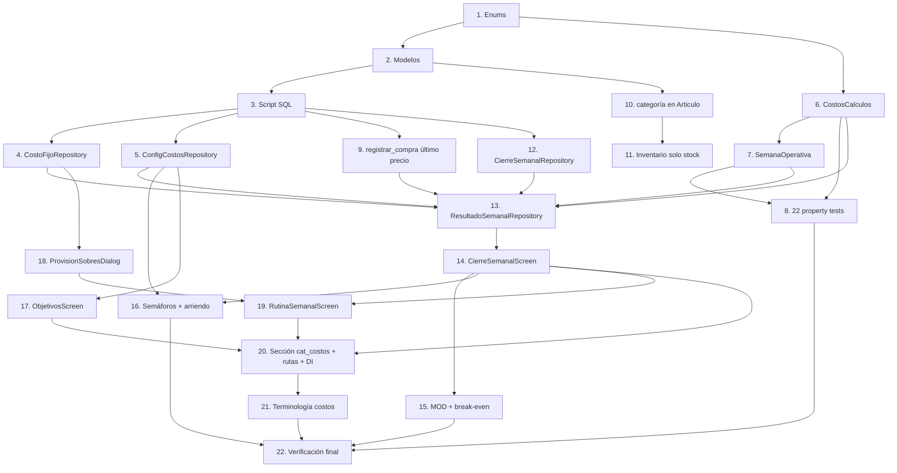

# Implementation Plan

## Overview

Plan de implementación de "control-de-costos" para ToppisERP. Sigue las 7 fases del diseño (A–G). Cada tarea es incremental y termina con `./gradlew :app:assembleDebug` verde; al cerrar cada fase se hace commit + push. El SQL lo ejecuta el usuario manualmente en Supabase (el agente solo escribe el script). Convenciones: Kotlin/Compose MVVM (ViewModel + Factory + Screen), DI manual en `MainActivity`, rutas en `NavGraph`, opción de menú en `HomeMenu`; modelos `@Serializable` snake_case; enums en `Enums.kt`. Reutilizar componentes existentes (ToppisTopBar, BackScaffold, SearchField, StateComponents, ToppisDialogs, DatePickerField) y el patrón `cargandoInicial`.

## Tasks

### Fase A — Datos base (enums, modelos, SQL, repos de configuración)

- [x] 1. Agregar enums nuevos en `data/db/entities/Enums.kt`
  - `Periodicidad(label, divisorSemanal)`: SEMANAL(1.0), MENSUAL(4.33), ANUAL(52.0)
  - `CategoriaArticulo(label)`: INGREDIENTES, PACKAGING, INSUMOS
  - `EstadoCierre`: ABIERTO, CERRADO; `GrupoCosto(label)`: VARIABLE, FIJO
  - `EstadoSemaforo`: FAVORABLE, ALERTA (no @Serializable); `PasoRutina(label)`: CONTEO, MERMAS, PROVISION, RESULTADO
  - _Requirements: 2.1, 2.2, 2.3, 3.1, 6.1, 7.1, 14.1, 15.6_

- [x] 2. Crear modelos `@Serializable` en `data/models/`
  - `CostoFijo`, `CierreSemanal`, `ConfigCosto`, `PasoRutinaSemanal`
  - Agregar campo `categoria: CategoriaArticulo = INGREDIENTES` al modelo `Articulo`
  - _Requirements: 1.1, 3.1, 3.2, 6.1_

- [x] 3. Escribir el script SQL `.kiro/database/supabase-control-costos.sql` (lo ejecuta el usuario)
  - `ALTER TABLE articulos ADD COLUMN categoria` (default 'INGREDIENTES' + CHECK IN)
  - `CREATE TABLE costos_fijos` (monto CHECK >= 0, periodicidad CHECK, activo default true, local_id)
  - `CREATE TABLE config_costos` (PK local_id+clave) + INSERT defaults 0.32/0.30/0.10/umbral 0 (ON CONFLICT DO NOTHING)
  - `CREATE TABLE cierres_semanales` (UNIQUE local_id+semana_inicio); `CREATE TABLE pasos_rutina_semanal` (UNIQUE local_id+semana_inicio+paso)
  - Políticas RLS equivalentes a las existentes; comentario "Ejecutar manualmente en Supabase SQL Editor"
  - _Requirements: 1.1, 1.2, 1.6, 3.1, 6.1, 10.1, 11.1, 14.1, 15.1_

- [x] 4. Crear `CostoFijoRepository` (CRUD; validar monto >= 0; sellar `local_id`)
  - _Requirements: 1.1, 1.3, 1.4, 1.5, 1.6_

- [x] 5. Crear `ConfigCostosRepository` (getConfig con defaults; guardarConfig upsert)
  - _Requirements: 10.1, 11.1, 15.1_

### Fase B — Dominio puro + tests de propiedad

- [x] 6. Crear capa de cálculo pura `domain/costos/CostosCalculos.kt`
  - prorrateoSemanal, totalFijosSemanales, resultadoSemanal, margenContribucion, breakEven (null si margen<=0), manoObraDisponible, manoObraPorPersona, alcanzaParaContratar, semaforo, porcentajeSobreVentas
  - `grupoDe(CategoriaGasto): GrupoCosto?` (INSUMOS/PACKAGING/ENVIOS/TRANSPORTE→VARIABLE; ARRIENDO/SERVICIOS/SUELDOS→FIJO; OTROS→null=manual); modelo "último precio" y snapshot en memoria
  - _Requirements: 2.4, 5.1, 5.2, 5.3, 7.1, 7.2, 7.3, 7.4, 7.5, 8.2, 9.3, 10.2, 10.3, 10.4, 10.5, 10.6, 12.1, 12.2, 12.3, 12.4, 12.5_

- [x] 7. Agregar `SemanaOperativa` y utilidades a `data/util/FechaUtil.kt` (lunes→domingo, incluye sábado)
  - _Requirements: 9.1_

- [x] 8. Configurar kotest-property y escribir los 22 tests de propiedad en `app/src/test`
  - Mínimo 100 iteraciones por test; un test por propiedad; comentario "// Feature: control-de-costos, Property N: ..."; generadores con edge cases (monto 0, ventas 0, empleados 0, margen ≤ 0)
  - _Properties: 1, 2, 3, 4, 5, 6, 7, 8, 9, 10, 11, 12, 13, 14, 15, 16, 17, 18, 19, 20, 21, 22_

### Fase C — Compras último precio + Inventario solo stock + categoría de artículo

- [x] 9. Actualizar la RPC `registrar_compra` a "último precio" en el script SQL
  - Crear `recalcular_recetas_articulo(p_articulo_id)`; en el loop: si cambió el costo → UPDATE + recalcular recetas; si es igual → solo stock. Mantener la firma actual de la RPC.
  - _Requirements: 5.1, 5.2, 5.3, 5.4_

- [x] 10. Ajustar `Articulo` y su formulario para incluir `categoria` (selector fijo, default INGREDIENTES)
  - _Requirements: 3.1, 3.2, 3.3_

- [x] 11. Dejar `InventarioScreen` solo con stock (quitar costo/costeo; EmptyState sin stock)
  - _Requirements: 4.1, 4.2, 4.3_

### Fase D — Resultado / Cierre semanal

- [x] 12. Crear `CierreSemanalRepository` + RPC `confirmar_cierre_semanal` (INSERT ON CONFLICT DO NOTHING)
  - _Requirements: 6.1, 6.2, 6.3_

- [x] 13. Crear `ResultadoSemanalRepository` (agregador)
  - Si semana CERRADA → snapshot; si abierta → cálculo en vivo. Reúne ventas, compras, gastos variables no vinculados a compras, sueldos (jornadas + gastos SUELDOS), fijos prorrateados, food teórico (solo %)
  - _Requirements: 8.1, 8.2, 8.3, 9.2, 9.3, 9.4_

- [x] 14. Crear `CierreSemanalScreen` + `CierreSemanalViewModel` + Factory
  - Selector de semana; tarjetas ventas/variables/mano de obra/fijos; "lo que queda"; %food/%labor; estado; botón Confirmar cierre; cargandoInicial; errores en ToppisErrorDialog; sin utilidad/reparto
  - _Requirements: 9.1, 9.2, 9.3, 9.4, 9.6, 6.1, 17.1, 17.2_

### Fase E — Mano de obra, break-even, semáforos, objetivos

- [x] 15. Integrar mano de obra disponible y break-even en la pantalla de resultado
  - MOD (pct × ventas), por persona (÷ empleados activos), indicador contratar, casos 0 empleados / 0 disponible; break-even + "cuánto falta"; margen ≤ 0 no calculable
  - _Requirements: 10.2, 10.3, 10.4, 10.5, 10.6, 10.7, 12.3, 12.4, 12.5, 9.5_

- [x] 16. Agregar semáforos y alerta de arriendo en la pantalla de resultado
  - Semáforos food/labor/arriendo; alerta bajo break-even; alerta arriendo prorrateado > techo × ventas
  - _Requirements: 11.2, 15.2, 15.3, 15.4, 15.5, 15.6_

- [x] 17. Crear `ObjetivosScreen` + `ObjetivosViewModel` + Factory (guardar en config_costos)
  - _Requirements: 10.1, 11.1, 15.1_

### Fase F — Provisión en sobres + rutina semanal

- [ ] 18. Crear `ProvisionSobresDialog` (reutiliza `SobreRepository.transferir`)
  - Sugerir monto = prorrateo semanal (solo > 0); selector Sobre_Cuenta origen; sugerir/crear Sobre_Fondo por categoría; advertir saldo insuficiente solo si hay fijos por provisionar; confirmar transferencia
  - _Requirements: 13.1, 13.2, 13.3, 13.4, 13.5, 13.6_

- [ ] 19. Crear `RutinaSemanalScreen` + `RutinaSemanalViewModel` + `RutinaSemanalRepository`
  - Checklist 4 pasos que navega a módulos existentes sin duplicar; marcar pasos por semana; habilitar Confirmar cierre solo con pasos + validaciones OK; listar faltantes
  - _Requirements: 14.1, 14.2, 14.3, 14.4, 14.5_

### Fase G — Sección de menú "Costos" y terminología

- [x] 20. Agregar la sección `cat_costos` en `HomeMenu.kt` + rutas en `NavGraph.kt` + DI en `MainActivity`
  - "Costos" (soloAdmin): Resultado semanal, Rutina de cierre, Costos fijos, Objetivos y semáforos + referencias a Costos puntuales (gastos), Sobres, Flujo de caja; color de acento propio
  - _Requirements: 16.1_

- [ ] 21. Unificar terminología "gastos" → "costos" en las pantallas de esta sección
  - _Requirements: 16.2, 16.3_

- [ ] 22. Verificación final e integración
  - Build verde; correr tests de propiedad; verificar navegación y flujo del cierre semanal; actualizar `README.md` y `.kiro/PROYECTO-CONTEXTO.md`
  - _Requirements: 9.6, 16.1, 17.1_

## Task Dependency Graph



```json
{
  "waves": [
    { "wave": 1, "tasks": ["1"] },
    { "wave": 2, "tasks": ["2", "6"] },
    { "wave": 3, "tasks": ["3", "7"] },
    { "wave": 4, "tasks": ["4", "5", "8", "9", "10", "12"] },
    { "wave": 5, "tasks": ["11", "13", "17", "18"] },
    { "wave": 6, "tasks": ["14"] },
    { "wave": 7, "tasks": ["15", "16", "19", "20"] },
    { "wave": 8, "tasks": ["21"] },
    { "wave": 9, "tasks": ["22"] }
  ]
}
```

## Notes

- El SQL (tareas 3 y 9) lo ejecuta el usuario manualmente en el SQL Editor de Supabase; el agente solo escribe/actualiza `.kiro/database/supabase-control-costos.sql`.
- Convención anti doble-conteo: los sueldos fijos mensuales van como `costos_fijos` (grupo FIJO, prorrateados); los pagos por turno/hora van como `jornadas` (mano de obra pagada). No cargar un sueldo fijo también como jornada.
- Las 22 propiedades del diseño se prueban sobre la capa pura con kotest-property (≥100 iteraciones, un test por propiedad).
- Fuera de alcance: cálculo de utilidad neta y reparto entre socios (Requerimiento 17).
- Cada fase termina con `./gradlew :app:assembleDebug` verde + commit y push.
