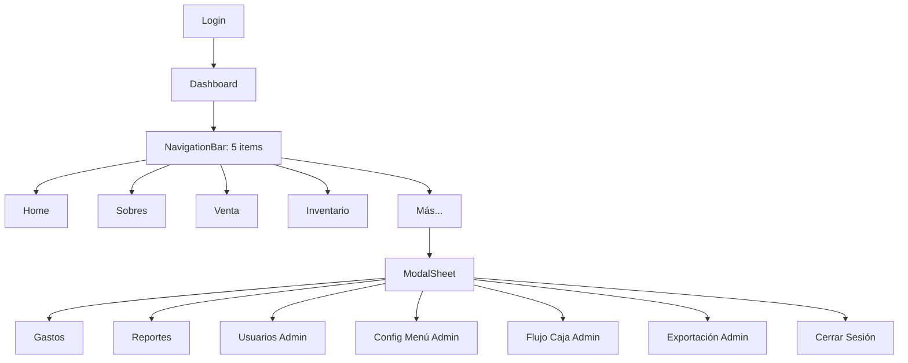

# Refactorización de Navegación y UI

## Estado: Completed
## Prioridad: Alta
## Estimación: 3-5 horas
## Tiempo Real: 3 horas

---

## 1. Contexto y Problema

### Situación Actual
La app ToppisERP tiene navegación inconsistente:
- NavigationBar duplicado en cada pantalla (8 archivos diferentes)
- Entre 6-8 items por barra (Material recomienda máximo 5)
- Callbacks de navegación repetidos en cada screen (5-7 por pantalla)
- Indicadores de "selected" inconsistentes
- Usuarios Admin ven barras distintas que usuarios Cajero

### Impacto
- Mantenimiento complejo (cambiar navegación = tocar 8+ archivos)
- UX confusa (la barra cambia según dónde estés)
- Violación de Material Design guidelines
- Código duplicado masivamente

---

## 2. Objetivos

### Objetivo Principal
Centralizar la navegación en un único componente MainScaffold con barra de navegación consistente en toda la app.

### Objetivos Específicos
1. Reducir items de navegación inferior a máximo 5
2. Eliminar código duplicado de NavigationBar
3. Mantener accesibilidad rápida a funciones principales
4. Preservar diferencias entre rol Admin y Cajero
5. Mejorar UX con navegación predecible

---

## 3. Requisitos

### Requisitos Funcionales

#### RF-1: Barra de Navegación Inferior Unificada
- **Descripción**: Una sola NavigationBar fija con 5 items para todos los usuarios
- **Items propuestos**:
  1. 🏠 **Home** → Dashboard (siempre visible)
  2. 💰 **Sobres** → Gestión de sobres (siempre visible)
  3. 🛒 **Venta** → POS/Punto de venta (siempre visible)
  4. 📦 **Inventario** → Insumos e ingredientes (siempre visible)
  5. ⋮ **Más** → Menú adicional (siempre visible)
- **Comportamiento**: Indicador visual de sección activa
- **Restricción**: Los 5 items son iguales para Admin y Cajero

#### RF-2: Menú "Más" Contextual
- **Descripción**: Al presionar "Más" se abre un ModalBottomSheet con opciones adicionales
- **Items para todos los usuarios**:
  - 💵 Gastos → Registro de gastos
  - 📊 Reportes → Ventas vs gastos
- **Items solo Admin** (se ocultan si usuario es Cajero):
  - 👥 Usuarios → Gestión de usuarios
  - 🍽️ Configurar Menú → Items y recetas
  - 📈 Flujo de Caja → Análisis y proyección
  - 📤 Exportación → Excel/CSV/ZIP
- **Items siempre visibles**:
  - 🚪 Cerrar Sesión → Logout

#### RF-3: MainScaffold Centralizado
- **Ubicación**: Nuevo archivo `ui/components/MainScaffold.kt`
- **Responsabilidad**: Proveer estructura común (TopBar + BottomNav + Sheet "Más")
- **Parámetros**:
  - `currentRoute: String` - para marcar item activo
  - `isAdmin: Boolean` - para filtrar opciones admin en sheet
  - `navController: NavHostController` - para navegar
  - `onLogout: () -> Unit` - callback de cierre de sesión
  - `content: @Composable () -> Unit` - contenido de la screen

#### RF-4: Eliminación de NavigationBar Individual
- **Alcance**: Remover NavigationBar de estos archivos:
  - `DashboardScreen.kt`
  - `SobresScreen.kt`
  - `PosScreen.kt`
  - `InventarioScreen.kt`
  - `GastosScreen.kt`
  - `ReportesScreen.kt`
- **Acción**: Cada screen solo define su contenido, sin Scaffold ni barra

#### RF-5: TopBar Consistente
- **Ubicación**: Dentro de MainScaffold
- **Comportamiento**:
  - Muestra título de sección actual
  - Botón "Volver" solo en pantallas secundarias (Usuarios, Exportación, Flujo, Menu Config)
  - Pantallas principales (Dashboard, Sobres, POS, Inventario, Gastos, Reportes) sin botón volver

### Requisitos No Funcionales

#### RNF-1: Compatibilidad
- Mantener soporte para Jetpack Compose actual
- No romper lógica de auth existente
- Preservar todos los ViewModels actuales

#### RNF-2: Accesibilidad
- Content descriptions en todos los iconos
- Navegación por teclado funcional
- Contraste de colores según Material3

#### RNF-3: Performance
- No impacto en recomposiciones
- Navigation state persiste en cambios de configuración

---

## 4. Diseño Propuesto

### 4.1 Arquitectura de Componentes

```
NavGraph (modificado)
  ├── LoginScreen (sin cambios)
  └── MainScaffold (NUEVO)
        ├── TopAppBar (condicional)
        ├── BottomNavigationBar (fijo, 5 items)
        ├── ModalBottomSheet "Más" (condicional)
        └── NavHost con screens
              ├── DashboardScreen (simplificado)
              ├── SobresScreen (simplificado)
              ├── PosScreen (simplificado)
              ├── InventarioScreen (simplificado)
              ├── GastosScreen (simplificado)
              ├── ReportesScreen (simplificado)
              ├── UsuariosScreen (sin cambios)
              ├── MenuConfigScreen (sin cambios)
              ├── FlujoCajaScreen (sin cambios)
              └── ExportacionScreen (sin cambios)
```

### 4.2 Flujo de Navegación



### 4.3 Estructura de Archivos

```
app/src/main/java/com/toppis/app/ui/
├── components/
│   ├── ToppisTopBar.kt (existente, sin cambios)
│   └── MainScaffold.kt (NUEVO)
├── navigation/
│   └── NavGraph.kt (MODIFICADO)
├── dashboard/
│   └── DashboardScreen.kt (SIMPLIFICADO)
├── sobres/
│   └── SobresScreen.kt (SIMPLIFICADO)
├── pos/
│   └── PosScreen.kt (SIMPLIFICADO)
├── inventario/
│   └── InventarioScreen.kt (SIMPLIFICADO)
├── gastos/
│   └── GastosScreen.kt (SIMPLIFICADO)
├── reportes/
│   └── ReportesScreen.kt (SIMPLIFICADO)
└── [otros screens sin cambios]
```

---

## 5. Tareas de Implementación

### Tarea 1: Crear MainScaffold
- **Archivo**: `ui/components/MainScaffold.kt`
- **Descripción**: Componente wrapper con NavigationBar de 5 items y ModalBottomSheet "Más"
- **Dependencias**: Ninguna
- **Estimación**: 45 min
- **Estado**: ✅ Completed

**Detalles**:
- NavigationBar con iconos: Home, AccountBalance, ShoppingCart, List, MoreVert
- Estado `showMoreSheet` para controlar el ModalBottomSheet
- ModalBottomSheet con lista de opciones filtradas por `isAdmin`
- Navegación usando `navController.navigate()` con `launchSingleTop = true`

---

### Tarea 2: Refactorizar NavGraph
- **Archivo**: `ui/navigation/NavGraph.kt`
- **Descripción**: Envolver rutas principales en MainScaffold, pasar `navController` y `authViewModel`
- **Dependencias**: Tarea 1
- **Estimación**: 30 min
- **Estado**: ✅ Completed

**Detalles**:
- Mantener ruta "login" sin MainScaffold
- Rutas principales (dashboard, sobres, pos, inventario, gastos, reportes) envueltas en MainScaffold
- Rutas admin (usuarios, menu_config, flujo_caja, exportacion) fuera de MainScaffold (pantallas de detalle)
- Pasar `currentRoute` desde `navController.currentBackStackEntry?.destination?.route`

---

### Tarea 3: Simplificar DashboardScreen
- **Archivo**: `ui/dashboard/DashboardScreen.kt`
- **Descripción**: Eliminar Scaffold, TopBar, BottomNavigationBar y callbacks de navegación
- **Dependencias**: Tarea 2
- **Estimación**: 15 min
- **Estado**: ✅ Completed

**Cambios**:
- Remover parámetros: `onNavigateToSobres`, `onNavigateToVenta`, `onNavigateToInventario`, `onNavigateToGastos`, `onNavigateToReportes`, `onNavigateToUsuarios`, `onNavigateToFlujoCaja`, `onNavigateToMenuConfig`, `onLogout`
- Remover `Scaffold`, `ToppisTopBar`, `NavigationBar`
- Retornar solo el contenido (Column con padding)

---

### Tarea 4: Simplificar SobresScreen
- **Archivo**: `ui/sobres/SobresScreen.kt`
- **Descripción**: Eliminar Scaffold, TopBar, BottomNavigationBar y callbacks de navegación
- **Dependencias**: Tarea 2
- **Estimación**: 15 min
- **Estado**: ✅ Completed

**Cambios**:
- Remover parámetros: `onNavigateToDashboard`, `onNavigateToVenta`, `onNavigateToInventario`, `onNavigateToGastos`, `onNavigateToReportes`, `onNavigateToUsuarios`, `onNavigateToFlujoCaja`, `onLogout`
- Remover `Scaffold`, `ToppisTopBar`, `NavigationBar`
- Mantener `SnackbarHost` como parte del contenido

---

### Tarea 5: Simplificar PosScreen
- **Archivo**: `ui/pos/PosScreen.kt`
- **Descripción**: Eliminar Scaffold, TopBar, BottomNavigationBar y callbacks de navegación
- **Dependencias**: Tarea 2
- **Estimación**: 15 min
- **Estado**: ✅ Completed

**Cambios**:
- Remover parámetros: `onNavigateToSobres`, `onNavigateToInventario`, `onNavigateToGastos`, `onNavigateToReportes`, `onNavigateToUsuarios`, `onNavigateToFlujoCaja`
- Remover `Scaffold`, `ToppisTopBar`, `NavigationBar`
- Mantener lógica de diálogos y snackbar

---

### Tarea 6: Simplificar InventarioScreen
- **Archivo**: `ui/inventario/InventarioScreen.kt`
- **Descripción**: Eliminar Scaffold, TopBar, BottomNavigationBar y callbacks de navegación
- **Dependencias**: Tarea 2
- **Estimación**: 15 min
- **Estado**: ✅ Completed

---

### Tarea 7: Simplificar GastosScreen
- **Archivo**: `ui/gastos/GastosScreen.kt`
- **Descripción**: Eliminar Scaffold, TopBar, BottomNavigationBar y callbacks de navegación
- **Dependencias**: Tarea 2
- **Estimación**: 15 min
- **Estado**: ✅ Completed

---

### Tarea 8: Simplificar ReportesScreen
- **Archivo**: `ui/reportes/ReportesScreen.kt`
- **Descripción**: Eliminar Scaffold, TopBar, BottomNavigationBar y callbacks de navegación
- **Dependencias**: Tarea 2
- **Estimación**: 15 min
- **Estado**: ✅ Completed

---

### Tarea 9: Ajustar Pantallas Admin (TopBar con Volver)
- **Archivos**: `UsuariosScreen.kt`, `MenuConfigScreen.kt`, `FlujoCajaScreen.kt`, `ExportacionScreen.kt`
- **Descripción**: Verificar que tienen TopBar con botón volver (ya lo tienen, no requiere cambios)
- **Dependencias**: Tarea 8
- **Estimación**: 10 min
- **Estado**: ✅ Completed (sin cambios necesarios)

---

### Tarea 10: Testing Manual Completo
- **Descripción**: Probar flujo completo con usuario Admin y Cajero
- **Dependencias**: Tarea 9
- **Estimación**: 30 min
- **Estado**: Pending (requiere testing manual del usuario)

**Casos de prueba**:
1. Login como Admin → verificar 6 opciones en sheet "Más"
2. Login como Cajero → verificar 2 opciones en sheet "Más"
3. Navegación entre las 5 pantallas principales → verificar indicador activo
4. Navegación desde sheet "Más" → verificar que cierra el sheet y navega
5. Logout desde sheet "Más" → verificar redirección a login
6. Verificar back button en pantallas admin (Usuarios, Config Menú, Flujo, Exportación)

---

## 6. Riesgos y Mitigaciones

| Riesgo | Probabilidad | Impacto | Mitigación |
|--------|--------------|---------|------------|
| Romper navegación existente | Media | Alto | Testing exhaustivo tarea 10, rollback fácil con git |
| Performance en ModalSheet con muchas opciones | Baja | Bajo | Son solo 7 items máximo, sin scroll |
| Confusión usuarios con nuevo menú | Media | Medio | Documentar cambios, iconos descriptivos |
| Problemas con state de navegación | Baja | Medio | Usar `launchSingleTop` y `saveState` |

---

## 7. Criterios de Aceptación

- [x] Todas las pantallas principales tienen NavigationBar idéntico de 5 items
- [x] Indicador visual correcto de pantalla activa
- [x] Botón "Más" abre sheet con opciones correctas según rol
- [x] Cajero ve solo 3 opciones en sheet "Más" (Gastos, Reportes, Cerrar Sesión)
- [x] Admin ve 7 opciones en sheet "Más" (todas las anteriores + Usuarios, Config, Flujo, Export)
- [x] Logout funciona desde sheet "Más"
- [x] Pantallas admin tienen botón volver
- [x] No hay código duplicado de NavigationBar
- [x] No hay warnings ni errores de compilación
- [ ] App funciona igual que antes funcionalmente (requiere testing manual)

---

## 8. Notas Adicionales

### Consideraciones de Diseño
- Material 3 recomienda usar NavigationBar para 3-5 destinos principales
- NavigationRail sería alternativa para tablets (futuro)
- ModalBottomSheet es pattern estándar para overflow de navegación

### Posibles Mejoras Futuras (fuera de scope)
- Agregar NavigationDrawer para tablets/landscape
- Animaciones entre transiciones de pantalla
- Shortcuts de teclado para navegación rápida
- Breadcrumbs en pantallas admin

---

## 9. Referencias

- [Material 3 Navigation Bar](https://m3.material.io/components/navigation-bar/overview)
- [Jetpack Compose Navigation](https://developer.android.com/jetpack/compose/navigation)
- [Bottom Sheet Material 3](https://m3.material.io/components/bottom-sheets/overview)

---

**Fecha de Creación**: 2026-06-08  
**Autor**: Kiro + andreslh  
**Última Actualización**: 2026-06-08
